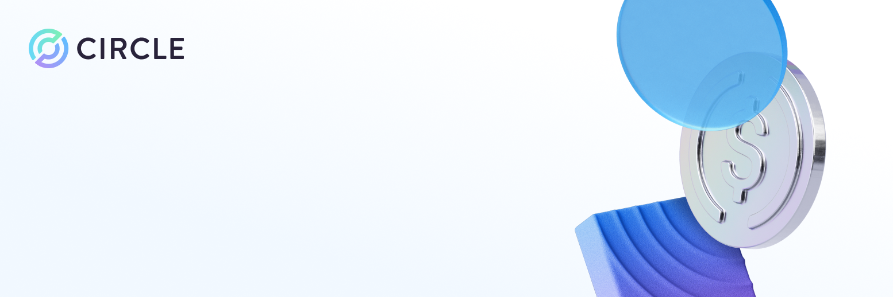

# Circle Skills



Ship stablecoin apps faster with Circle [Skills](https://agentskills.io): best-practice guidance for USDC payments, crosschain transfers, wallets, and smart contracts, plus Circle's MCP server for real-time SDK and documentation context.

[](https://x.com/circle)
[](https://discord.com/invite/buildoncircle)
[](https://www.youtube.com/c/Circlecryptofinance)
[](https://www.circle.com)
[](https://developers.circle.com)
[](https://www.arc.network)
[](https://developers.circle.com/stablecoins/usdc-contract-addresses)

## Installation

### Claude Code
```
/plugin marketplace add circlefin/skills
/plugin install circle-skills@circle
```

### Vercel Skills CLI
```bash
npx skills add circlefin/skills
```

## Skills

| Skill | Description |
|-------|-------------|
| [`use-usdc`](https://github.com/circlefin/skills/blob/master/plugins/circle/skills/use-usdc/SKILL.md) | Interact with USDC on EVM chains and Solana. Check balances, send transfers, approve spending, and verify transactions. |
| [`bridge-stablecoin`](https://github.com/circlefin/skills/blob/master/plugins/circle/skills/bridge-stablecoin/SKILL.md) | Crosschain USDC transfers using CCTP (Crosschain Transfer Protocol). Includes UX patterns, progress tracking, and Bridge Kit SDK implementation. |
| [`use-arc`](https://github.com/circlefin/skills/blob/master/plugins/circle/skills/use-arc/SKILL.md) | Build on Arc, Circle's blockchain where USDC is the native gas token. Covers chain configuration, contract deployment, and bridging USDC to Arc via CCTP. |
| [`use-circle-wallets`](https://github.com/circlefin/skills/blob/master/plugins/circle/skills/use-circle-wallets/SKILL.md) | Choose the right Circle wallet type. Compares developer-controlled, user-controlled, and modular (passkey) wallets across custody model, key management, and use cases. |
| [`use-developer-controlled-wallets`](https://github.com/circlefin/skills/blob/master/plugins/circle/skills/use-developer-controlled-wallets/SKILL.md) | Developer-controlled wallets for custodial flows like payouts, treasury management, and automation. Developers manage wallet creation and key storage. |
| [`use-gateway`](https://github.com/circlefin/skills/blob/master/plugins/circle/skills/use-gateway/SKILL.md) | Unified USDC balance across chains with instant crosschain transfers (<500ms). Supports EVM and Solana with deposit, balance query, and transfer workflows. |
| [`use-modular-wallets`](https://github.com/circlefin/skills/blob/master/plugins/circle/skills/use-modular-wallets/SKILL.md) | Smart contract wallets with passkey authentication, gasless transactions, and modular architecture. Supports ERC-4337 account abstraction. |
| [`use-smart-contract-platform`](https://github.com/circlefin/skills/blob/master/plugins/circle/skills/use-smart-contract-platform/SKILL.md) | Deploy, import, interact with, and monitor smart contracts using Circle's Smart Contract Platform. Supports bytecode deployment, template contracts (ERC-20/721/1155), ABI-based read/write calls, and event monitoring. |
| [`use-user-controlled-wallets`](https://github.com/circlefin/skills/blob/master/plugins/circle/skills/use-user-controlled-wallets/SKILL.md) | Embedded wallets where users control their own assets. Supports Web2-like login (Google, Facebook, Apple, email OTP, PIN) without seed phrases. |
| [`swap-tokens`](https://github.com/circlefin/skills/blob/master/plugins/circle/skills/swap-tokens/SKILL.md) | Build token swap functionality with Circle App Kit or standalone Swap Kit. Supports same-chain swaps, slippage configuration, swap fee collection, and cross-chain token movement by combining swap and bridge calls. |

## Circle MCP
Skills contain stable patterns (architecture decisions, UX guidance, common mistakes). For ground-truth details that change frequently (e.g., SDK method signatures, contract addresses, chain IDs) use Circle's MCP server alongside skills.

| Client | Setup |
|--------|-------|
| **Cursor** | Add to `~/.cursor/mcp.json` |
| **Claude Code** | `claude mcp add --transport http circle https://api.circle.com/v1/codegen/mcp --scope user` |
| **Codex** | `codex mcp add circle --url https://api.circle.com/v1/codegen/mcp` |
| **Windsurf** | Add to `~/.codeium/windsurf/mcp_config.json` |

Manual config for Cursor, Windsurf, and other JSON-based clients:
```json
{
 "mcpServers": {
   "circle": {
     "url": "https://api.circle.com/v1/codegen/mcp"
   }
 }
}
```
Full setup guide: [developers.circle.com/ai/mcp](https://developers.circle.com/ai/mcp)

## How Skills Work
Skills provide context that help agents do specific things with greater accuracy:
- **Decision frameworks**: when to use CCTP vs Gateway, which wallet type fits your use case
- **Correct patterns**: USDC's 6-decimal rule, approve-then-deposit flows, passkey recovery
- **Common mistakes**: what breaks and why, so the agent avoids them upfront

Your agent reads the relevant `SKILL.md` while planning and generating code. You stay in control of what gets built.

## Updating
Skills are local files. To get the latest versions:
```bash
# Vercel CLI
npx skills update

# Claude Code
/plugin marketplace update
```
Skills are designed around patterns with infrequent changes, so they remain useful even if slightly behind. For details that change often (contract addresses, SDK signatures), use [Circle MCP](#circle-mcp) which updates over the air.

## Contributing
See [CONTRIBUTING.md](CONTRIBUTING.md) for guidelines.

## FAQ

**Do skills write code for me?**
No. Skills are instructions and best-practice patterns that steer an agent's outputs. Your agent generates the code; skills guide it.

**Do I need the MCP server?**
No. Skills work standalone. MCP adds accuracy for SDK details that change between versions.

## Resources
- [Circle Developer Docs](https://developers.circle.com)
- [Arc Docs](https://docs.arc.network)
- [Circle MCP Server](https://developers.circle.com/ai/mcp)
- [Testnet Faucet](https://faucet.circle.com)
- [USDC Contract Addresses](https://developers.circle.com/stablecoins/usdc-contract-addresses)

## Disclaimer
By using this skill, you acknowledge that any output generated in connection with the Skill may contain errors, omissions, outdated information, or fee configuration options, including options under which applicable fees may be directed to Circle Technology Services, LLC, and you are solely responsible for reviewing and validating all outputs and fee settings before taking any action. This skill is provided "as is," and Circle Technology Services, LLC disclaims liability for losses or damages arising from use of or reliance on output generated in connection with this skill; use of this skill is subject to the [Circle Developer Terms and Conditions](https://console.circle.com/legal/developer-terms).

## License
Apache 2.0 — see [LICENSE](LICENSE) for details.

